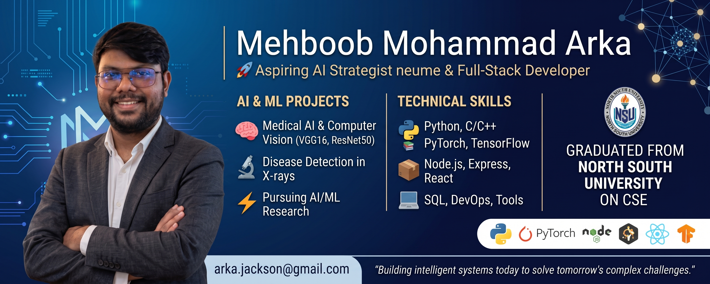

  

<h1 align="center">Hi 👋, I'm Mehboob Mohammad Arka</h1>
<h3 align="center">🚀 Aspiring AI Strategist & Full-Stack Developer</h3>

  <i>Driven by a passion for Artificial Intelligence, Machine Learning, and scalable digital infrastructure. I bridge the gap between academic AI research and real-world implementation—building intelligent, production-ready solutions with measurable impact.</i>

  
  
  

---

### 📌 About & Quick Contact

- 🎓 **Education:** Graduated in Computer Science & Engineering from North South University (NSU)
- 🔬 **Academic Focus:** Medical AI, Computer Vision & Disease Detection in X-ray Imaging
- 🔭 **Current Focus:** Learning Web Development & deepening AI expertise
- 📬 **Reach Me:** [arka.jackson@gmail.com](mailto:arka.jackson@gmail.com)

---

### 💻 Technical Toolbox

| Domain | Technologies & Tools |
| :--- | :--- |
| **Languages & Core** | Python, C/C++, Java, PHP, SQL, HTML5, CSS3, JavaScript, TypeScript |
| **AI / Machine Learning** | Computer Vision (CNNs, VGG16, ResNet50), PyTorch, TensorFlow, OpenCV, Scikit-Learn, Pandas, Seaborn |
| **Web & Frameworks** | Node.js, Express, React, Bootstrap, REST APIs, System Architecture & POS Integrations |
| **DevOps, DB & Tools** | Git, GitHub, MySQL, Figma, VS Code, Linux, Postman |

---

### 📊 Featured Highlights & Impact

* 🔬 **Medical AI & Computer Vision:** Researched, trained, and evaluated deep learning models (VGG16, ResNet50) for automated disease detection in X-ray imaging.
* 🎓 **EdTech Leadership:** Co-founded **Decoders Academy**, mentoring the next generation in Python programming, robotics, and computational logic.
* 🛠️ **Enterprise Systems:** Managing production IT infrastructure, payment gateway integrations, and data workflows in fast-paced retail and hospitality environments.

---

### 🛠️ Tech Stack Badges

   
   
   
   
   
   
   
   
   
   
   
   
   
   
   
   
   
   
   

---

### 📈 GitHub Analytics

&nbsp;

---

### 📌 Current Focus & Future Horizon

- 🧠 **Deepening AI Expertise:** Pursuing advanced postgraduate research in Artificial Intelligence & Machine Learning.
- ⚡ **Open Source & Projects:** Architecting computer vision models and full-stack API workflows.
- 📬 **Let's Connect:** Open to discussions on AI projects, computer vision research, and technical collaborations.

---

  <i>"Building intelligent systems today to solve tomorrow's complex challenges."</i>

